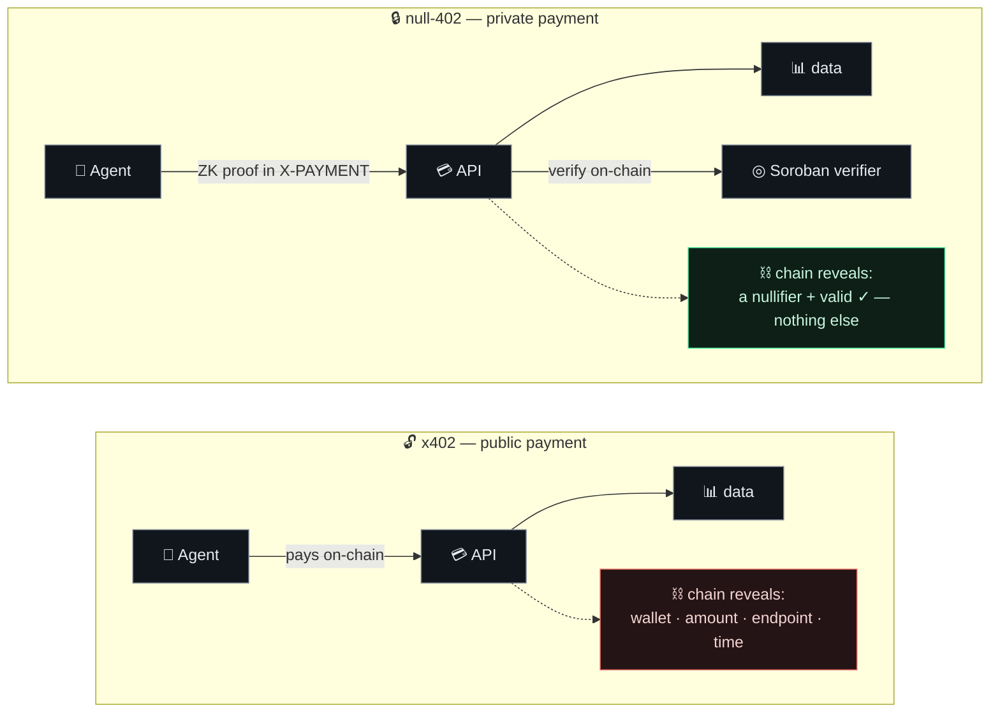
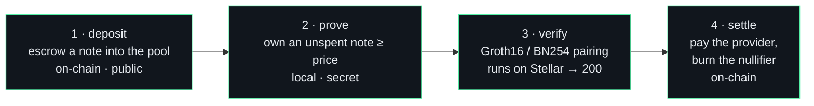

# null-402

> **x402, but the payment is a zero-knowledge proof.** Pay per call — reveal nothing.

Standard [x402](https://x402.org) turns an HTTP `402 Payment Required` into an on-chain
payment. But that payment is **public**: it broadcasts *who* paid, *how much*, and *which*
endpoint. For an autonomous agent buying data per call, that's a permanent, linkable trail.

**null-402** replaces the payment with a **Groth16 zero-knowledge proof** of an unspent note
in a shielded pool, verified **on-chain by a Soroban contract**. The API learns only that the
payment is `valid` — nothing about the payer, the amount, or the endpoint.

## x402 vs null-402 — the only difference is privacy

## How it works — deposit → prove → verify → settle

All deposits share **one Poseidon Merkle tree**, so every settlement references the same root
and a spend's nullifier can't be linked to a deposit — the anonymity set is the whole pool.

## What's inside

| Repo | What it is |
|---|---|
| [**null-402-sdk**](https://github.com/shinothelegend/null-402-sdk) | TypeScript SDK — prover, payment gate, on-chain verifier, pool helpers · [`npm i null-402`](https://www.npmjs.com/package/null-402) |
| [**null-402-contracts**](https://github.com/shinothelegend/null-402-contracts) | Soroban contracts (Rust) — Groth16/BN254 verifier + shielded pool |
| [**null-402-circuits**](https://github.com/shinothelegend/null-402-circuits) | Circom Groth16 payment circuit |
| [**null-402-gateway**](https://github.com/shinothelegend/null-402-gateway) | Reference x402 gateway (Hono / Cloudflare Workers) |
| [**null-402-dashboard**](https://github.com/shinothelegend/null-402-dashboard) | Public-vs-private demo UI — real in-browser proving |
| [**null-402-mcp**](https://github.com/shinothelegend/null-402-mcp) | MCP server — Claude / any agent pays x402 APIs privately |
| [**null-402-examples**](https://github.com/shinothelegend/null-402-examples) | Runnable end-to-end on-chain demos |
| [**null-402-docs**](https://github.com/shinothelegend/null-402-docs) · [**null-402-landing**](https://github.com/shinothelegend/null-402-landing) | Docs + landing |

## Live

- **npm:** [`null-402`](https://www.npmjs.com/package/null-402) — build a private paid endpoint in ~90 lines
- **Deployed on Stellar testnet:** verifier [`CDCYYFSJ…`](https://stellar.expert/explorer/testnet/contract/CDCYYFSJ7QC7RO6L2DHWK6X6IMZ5U5J3IEAKLKTBTBDX45LWO32JQJLV) · pool [`CCVYSIWU…`](https://stellar.expert/explorer/testnet/contract/CCVYSIWUAOZYFVAM6R76DMKDY4Y52SFIPY6CX3HBMUFF5Q4YS32C24XL)
- **Real on-chain settlement** reveals only a nullifier + payout — not the agent.

*Built on [Stellar](https://stellar.org) · Soroban · BN254 · Circom · Groth16.*
